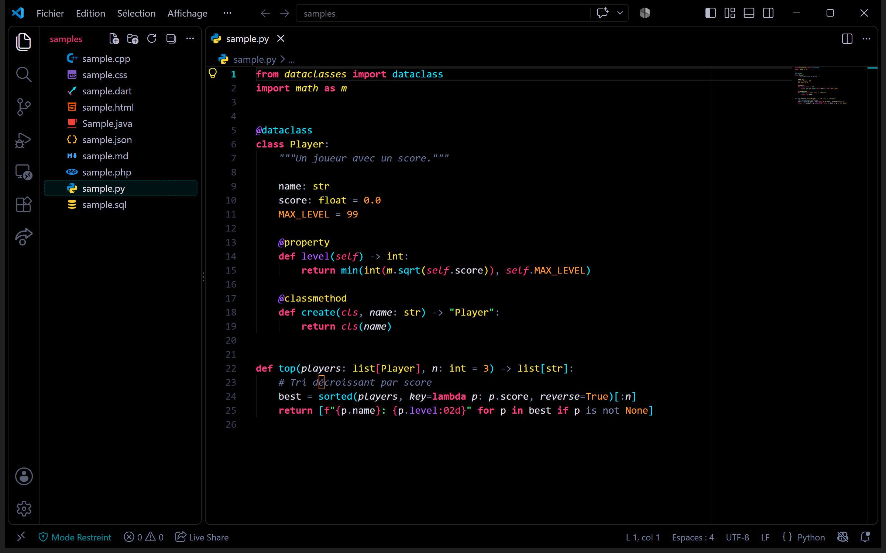
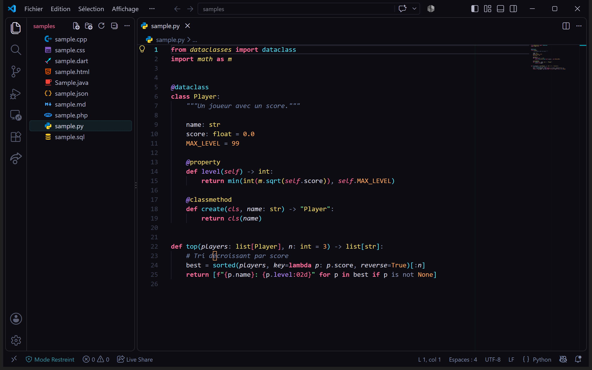

# Neon Void

Thème sombre **cyberpunk** pour Visual Studio Code : néons équilibrés sur **noir pur `#000000`**,
pensé pour les écrans AMOLED. Les pixels noirs y sont éteints, d'où un contraste infini et une
consommation réduite.

**[⬇ Télécharger la dernière version (.vsix)](https://github.com/Mat8313/neon-void-theme/releases/latest)**



## Philosophie

- **Tout est noir.** L'éditeur, les barres, les panneaux, le terminal, les onglets et les widgets
  n'ont aucun fond gris. Les zones se distinguent par de fines bordures `#1A1A1A`.
- **Un seul accent d'interface :** le cyan électrique `#00E5FF` (onglet actif, curseur, focus,
  badges, sélection).
- **Du néon dosé.** Les couleurs vives servent au code. L'interface reste sobre pour tenir de
  longues sessions.

## Palette

| Rôle | Couleur | Contraste sur #000 |
|---|---|---|
| Texte | `#E6E6F0` | 16,9:1 |
| Accent / fonctions | `#00E5FF` | 13,7:1 |
| Mots-clés (gras) | `#FF3D81` | 6,2:1 |
| Types / classes | `#F9E54A` | 16,3:1 |
| Chaînes | `#39FF88` | 15,8:1 |
| Propriétés / annotations | `#B266FF` | 6,2:1 |
| Nombres / constantes | `#FF9E3D` | 10,2:1 |
| Commentaires (italique) | `#6B7A9C` | 4,9:1 |

### Ajustements par rapport à la palette d'origine

- **Commentaires `#5C6A8A` → `#6B7A9C`** : la teinte d'origine n'atteignait que ~3,9:1 sur noir
  pur, sous le seuil de 4,5:1. On a éclairci sans changer la teinte bleu-gris. La couleur d'origine
  reste utilisée pour le « noir brillant » ANSI du terminal.
- **Rouge d'erreur `#FF4D6D` (ajouté)** : dérivé du rose, un peu plus rouge, pour que les erreurs
  et les suppressions git ne se confondent pas avec les mots-clés (surtout dans la minimap et la
  barre de défilement).
- **Bleu ANSI `#4D8DFF` (ajouté)** : la palette n'a pas de bleu, or `ls`, `git` et beaucoup de
  prompts en utilisent. Il sert uniquement dans le terminal.
- **Bordure des widgets flottants `#00E5FF40`** : avec un fond noir, une bordure `#1A1A1A` rend les
  suggestions et les survols presque invisibles au-dessus du code. On utilise donc un cyan à 25 %.
  Les zones fixes gardent `#1A1A1A`.

## Langages couverts finement

Java (types, génériques, annotations), Python (self, décorateurs, docstrings, f-strings),
C / C++ (préprocesseur, namespaces, templates, pointeurs), Dart / Flutter (annotations, widgets,
async/await), PHP, HTML, CSS, SQL, JSON et Markdown. Les autres langages profitent des règles
génériques.

## Variante Neon Void Soft

Même logique de couleurs, avec un fond gris-bleu très sombre (`#0C0C12`) et des néons un peu
moins saturés. Elle est pensée pour les écrans LCD, un second écran ou le soir. Elle est générée
depuis le thème principal : modifiez uniquement `neon-void-color-theme.json`, puis lancez
`npm run build` (c'est aussi fait automatiquement lors du packaging).



## Pensé pour l'OLED

Les éléments qui ne bougent jamais (icônes de la barre d'activité, trait de l'onglet actif,
barre d'état) sont volontairement atténués pour limiter le risque de marquage. Le néon à pleine
intensité est réservé au code, qui défile en permanence.

## Installation

1. Téléchargez le fichier `.vsix` depuis la
   **[dernière release](https://github.com/Mat8313/neon-void-theme/releases/latest)**.
2. Installez-le, au choix :
   - dans VS Code : panneau Extensions → `...` → **Install from VSIX...**
   - en ligne de commande :

     ```bash
     code --install-extension neon-void-theme-1.2.1.vsix
     ```

Vous pouvez aussi générer le `.vsix` depuis les sources :

```bash
git clone https://github.com/Mat8313/neon-void-theme.git
cd neon-void-theme
npm run package
```

Ensuite, ouvrez `Ctrl+K Ctrl+T` et choisissez **Neon Void**.

## Réglages conseillés

```jsonc
{
  "editor.bracketPairColorization.enabled": true,
  "editor.guides.bracketPairs": "active",
  "editor.semanticHighlighting.enabled": true,
  "workbench.colorTheme": "Neon Void"
}
```

## Personnaliser

Lancez **Developer: Inspect Editor Tokens and Scopes** depuis la palette de commandes et placez le
curseur sur un élément. Vous verrez son scope TextMate et son type sémantique. Il suffit ensuite de
les surcharger dans votre `settings.json`, sans modifier le thème :

```jsonc
"editor.tokenColorCustomizations": {
  "[Neon Void]": {
    "textMateRules": [
      { "scope": "storage.type.annotation.dart", "settings": { "foreground": "#FF9E3D" } }
    ]
  }
}
```

## Licence

MIT

## Bonus : icône Dart « fléchette néon »

Le dossier `icons/` contient deux SVG à utiliser avec Material Icon Theme (ils ne font pas
partie du thème). Copiez-les dans `~/.vscode/extensions/icons/`, puis ajoutez :

```jsonc
"material-icon-theme.files.associations": {
  "*.dart": "../../icons/neon-dart",
  "*.g.dart": "../../icons/neon-dart-generated",
  "*.freezed.dart": "../../icons/neon-dart-generated",
  "*.mocks.dart": "../../icons/neon-dart-generated"
}
```
